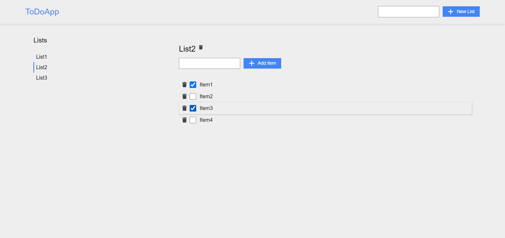

# To Do App
:white_check_mark: To Do List built with React.

### [Live Demo](https://dntodoapp.netlify.app/)



## Running Locally

```sh
yarn install
yarn dev
```

Runs the app in development mode.<br>
Open [http://localhost:3000](http://localhost:3000) to view it in the browser.